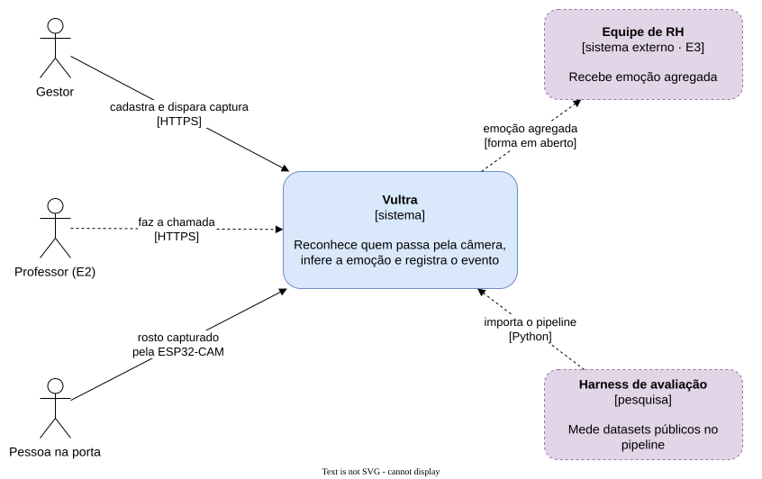

# Arquitetura

O mapa do sistema decidido nos ADRs [0005](../decisions/0005-backend-unico-em-python.md),
[0006](../decisions/0006-inferencia-no-processo-do-servico.md) e
[0007](../decisions/0007-canal-da-camera-por-websocket.md). Quase nada dele está construído: cada
elemento traz o estágio que o constrói (E1, E2, E3), e nos diagramas o que ainda não existe aparece
tracejado.

## Objetivo

Reconhecer quem passa por uma câmera ESP32-CAM na porta da sala, inferir a expressão facial no mesmo
quadro e registrar o evento, com o quadro existindo apenas em memória. O sistema é o objeto medido pelo
artigo da Iniciação Científica.

As metas de qualidade são os requisitos não funcionais do SRS:
[segurança](../requirements/non-functional/security.md),
[desempenho](../requirements/non-functional/performance.md),
[confiabilidade](../requirements/non-functional/reliability.md),
[flexibilidade](../requirements/non-functional/flexibility.md) e
[interação](../requirements/non-functional/interaction.md).

## Restrições

Estão na seção Restrições da [visão geral dos requisitos](../requirements/overview.md).

## Contexto

| Ator ou sistema | O que troca com o Vultra |
| --- | --- |
| Gestor | Cria pessoas, registra câmeras, dispara capturas e revoga cadastros, por HTTPS |
| Professor (E2) | Abre e encerra a chamada e corrige presença, por HTTPS |
| Pessoa na porta | O rosto, capturado pela ESP32-CAM |
| Equipe de RH (E3) | Recebe emoção agregada; a forma está em [OQ-05](../requirements/open-questions.md#oq-05) |
| Harness de avaliação | Importa o pacote do pipeline para medir datasets públicos; é artefato de pesquisa |

## Estratégia de solução

| Escolha | Decisão | ADR |
| --- | --- | --- |
| Um único serviço de backend, em Python com FastAPI | Uma linguagem, um conjunto de gates, e o harness mede o código de produção | [0005](../decisions/0005-backend-unico-em-python.md) |
| Módulos por capacidade, sem camadas técnicas | Interface só em fronteira externa real | [0005](../decisions/0005-backend-unico-em-python.md) |
| Inferência em pool de processos dentro do serviço | O quadro nunca sai da memória; a fila fica como saída | [0006](../decisions/0006-inferencia-no-processo-do-servico.md) |
| Câmera ligada por WebSocket sobre TLS | Um handshake por conexão; proposto até o teste de bancada | [0007](../decisions/0007-canal-da-camera-por-websocket.md) |
| PostgreSQL com pgvector e RLS | É o objeto da seção experimental do artigo | [ADR-001 de banco](../database/adrs/ADR-001-pgvector-hnsw.md) |
| Um compose para os dois ambientes | Local e nuvem diferem só na configuração | [0005](../decisions/0005-backend-unico-em-python.md) |

## Índice

| Seção | Onde |
| --- | --- |
| Blocos do sistema | [building-blocks/](building-blocks/README.md) |
| Cenários de execução | [runtime/](runtime/README.md) |
| Implantação e entrega | [deployment.md](deployment.md) |
| Conceitos transversais | [concepts/](concepts/README.md) |
| Decisões | [../decisions/](../decisions/README.md) |
| Riscos e dívida | [risks.md](risks.md) |
| Glossário | [../requirements/glossary.md](../requirements/glossary.md) |
