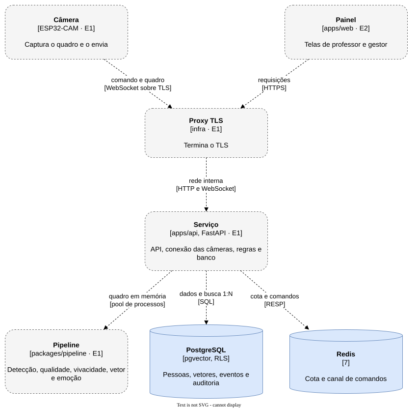

# Blocos do sistema

| Bloco | Tecnologia | Responsabilidade | Fala com (protocolo) | Estágio | Arquivo |
| --- | --- | --- | --- | --- | --- |
| Câmera | ESP32-CAM, firmware C++ | Captura o quadro e o envia | Proxy (WebSocket sobre TLS) | E1 | [camera.md](camera.md) |
| Proxy TLS | a escolher na spec de infraestrutura | Termina o TLS dos dois ambientes | Serviço e Painel (rede interna) | E1 | [proxy.md](proxy.md) |
| Serviço | Python 3.13, FastAPI | API, conexão das câmeras, regras e banco | Pipeline (pool de processos), PostgreSQL (SQL), Redis (RESP) | E1 | [service.md](service.md) |
| Pipeline | Python, ONNX Runtime, InsightFace | Detecção, qualidade, vivacidade, vetor e emoção | ninguém: é chamado pelo Serviço | E1 | [pipeline.md](pipeline.md) |
| PostgreSQL | 16 com pgvector 0.8 | Pessoas, vetores, eventos e auditoria, isolados por RLS | ninguém: é chamado pelo Serviço | existe | [postgres.md](postgres.md) |
| Redis | 7 | Cota e canal de comandos das câmeras | ninguém: é chamado pelo Serviço | existe | [redis.md](redis.md) |
| Painel | reavaliada no planejamento do E2 | Telas de professor e gestor | Proxy (HTTPS) | E2 | [panel.md](panel.md) |

`apps/api-core`, `apps/ai-service` e `packages/types` são o backend anterior, congelado, e não aparecem
no mapa: saem do repositório quando o Serviço do E1 existir.
