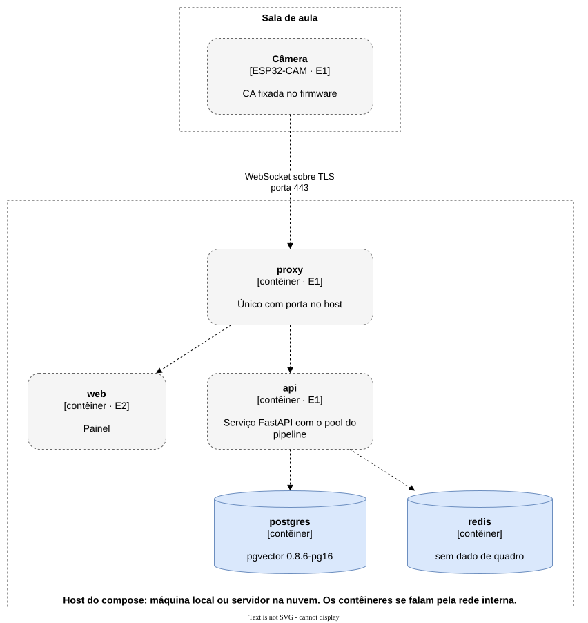

# Implantação e entrega

## Ambientes

Dois ambientes, os mesmos artefatos de build
([NFR-FLEX-01](../requirements/non-functional/flexibility.md#nfr-flex-01)). Um único arquivo de compose
sobe todos os contêineres; o que muda entre os ambientes é só a configuração.

| | Local | Nuvem |
| --- | --- | --- |
| Para que serve | Medir | Demonstrar |
| Onde roda | Uma máquina na mesma rede da câmera | Um servidor público |
| Certificado do proxy | CA própria | Público |
| Latência medida | Rede local | Inclui a internet |

## Onde cada bloco roda

| Bloco | Onde | Estágio |
| --- | --- | --- |
| Câmera | Na porta da sala, fora do compose | E1 |
| Proxy TLS | Contêiner; o único que publica porta no host | E1 |
| Serviço, com o pool do Pipeline | Contêiner | E1 |
| PostgreSQL | Contêiner | existe |
| Redis | Contêiner | existe |
| Painel | Contêiner | E2 |

O `infra/docker-compose.yml` de hoje sobe o backend anterior e publica as portas do banco, do Redis e
do `ai-service`. Ele é reescrito no E1.

## Entrega

- Todo trabalho entra na `main` por Pull Request aprovado pelo outro integrante. Não há branch de
  integração nem ambiente de homologação.
- Não existe CI: os gates rodam na máquina de quem desenvolve. Os gates de cada área estão no
  `AGENTS.md` dela.
- A `main` não tem proteção configurada (#158).
- Não existe processo de release: a nuvem recebe o que está na `main` quando o time decide demonstrar.
