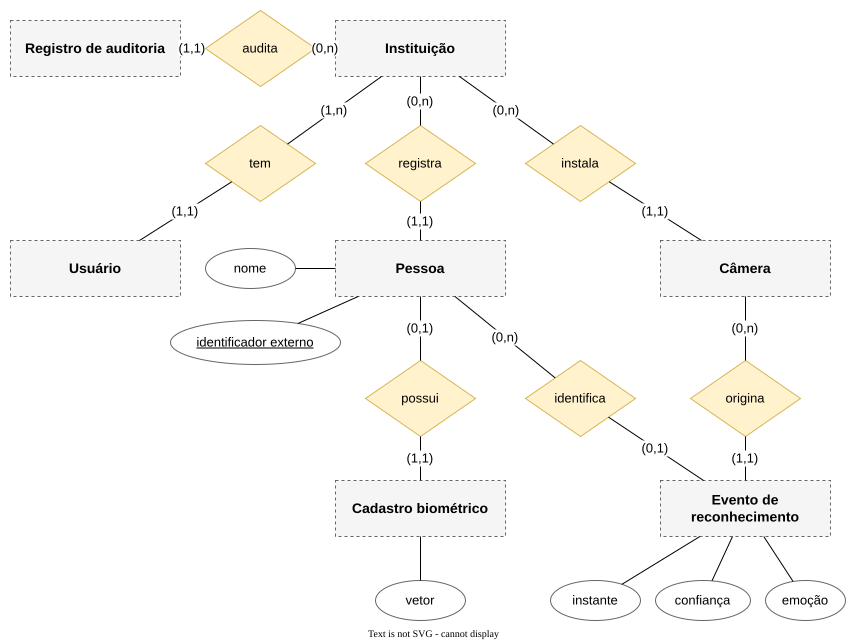
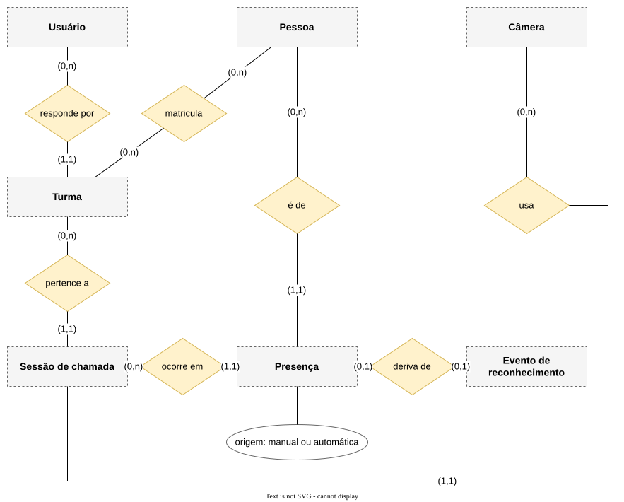

# Modelo de dados

O modelo conceitual do sistema decidido, derivado do [glossário](../requirements/glossary.md) e dos
requisitos. Nenhuma tabela do backend novo existe ainda.

## Núcleo (E1)

## Chamada (E2)

Usuário, Pessoa, Câmera e Evento de reconhecimento são as mesmas entidades do núcleo.

## Entidades

| Entidade | O que é uma instância | Estágio |
| --- | --- | --- |
| Instituição | Uma escola ou faculdade; a unidade de isolamento | E1 |
| Usuário | Alguém que autentica: gestor no E1, professor no E2 | E1 |
| Pessoa | Alguém da instituição que pode ter o rosto cadastrado | E1 |
| Câmera | Uma ESP32-CAM registrada, com credencial própria | E1 |
| Cadastro biométrico | O vínculo entre uma pessoa e o vetor do rosto dela | E1 |
| Evento de reconhecimento | O desfecho de uma captura de reconhecimento, com ou sem pessoa | E1 |
| Registro de auditoria | O rastro de uma operação sobre dado biométrico | E1 |
| Turma | Um grupo de alunos matriculados com um professor responsável | E2 |
| Sessão de chamada | O intervalo em que os eventos de uma câmera viram presença de uma turma | E2 |
| Presença | O registro de que um aluno esteve em uma sessão, automático ou manual | E2 |

A matrícula é a relação entre Pessoa e Turma, não uma entidade.

## Invariantes já decididas

- Uma pessoa tem no máximo um cadastro biométrico ativo.
- O identificador externo de uma pessoa é único dentro da instituição
  ([FR-REG-01](../requirements/functional/registry.md#fr-reg-01)).
- Um evento de reconhecimento sem pessoa não guarda vetor
  ([FR-REC-02](../requirements/functional/recognition.md#fr-rec-02)).
- Existe no máximo uma presença por aluno e sessão
  ([FR-ATT-04](../requirements/functional/attendance.md#fr-att-04)).
- Um registro de auditoria nunca é alterado nem apagado
  ([FR-GOV-01](../requirements/functional/governance.md#fr-gov-01)).
- Nenhuma entidade guarda o quadro ([BR-01](../requirements/business-rules.md#br-01)).

## Conteúdo

| Arquivo | O que guarda |
| --- | --- |
| [access-patterns.md](access-patterns.md) | As operações que o modelo precisa servir |
| [storage.md](storage.md) | O armazenamento físico |

O modelo lógico de cada entidade — atributos, tipos, chaves — não foi escrito: depende das specs do E1.
Cada entidade ganha o seu arquivo quando a spec que a define fechar.
